# Verification Guide

## Local Deployment

Please, use Node.js `10` and Npm `6` as they work good for all the micro-apps.

I've made small changes to the **micro-frontends-frame** and **micro-frontends-navbar-app** provided on the forum. So use updated code from my submission.

Before running the apps, add into your `/etc/hosts` the `line 127.0.0.1 local.topcoder-dev.com` so you could use domain `local.topcoder-dev.com` for the local testing. Alternatively, you may update file `micro-frontends-frame/config/local.json` to use domain `localhost` instead of `local.topcoder-dev.com`. Note, that without using domain `local.topcoder-dev.com` authorization would not work.

Run each of 3 applications and Mock API server in a new terminal window.

1. Run **micro-frontends-frame** app (provided on forum and updated):

   ```bash
   cd micro-frontends-frame

   npm install

   npm run local
   ```

   This would host the **frame** app on http://local.topcoder-dev.com:3000/.

2. Run **micro-frontends-navbar-app** app (provided on forum and updated):

   ```bash
   cd micro-frontends-navbar-app

   npm install

   npm run dev
   ```

   This would host the **navbar** app on http://local.topcoder-dev.com:8080/topcoder-micro-frontends-navbar-app.js (cannot open outside frame).

3. Run **micro-frontends-teams** app (this app)

   ```bash

   npm install

   npm run dev
   ```

   This would host the **teams** app on http://local.topcoder-dev.com:8501/topcoder-micro-frontends-teams.js (cannot open outside frame).

4. Run Mock API server:

   ```bash
   cd local/mock-server

   npm install

   npm run start
   ```

   This would host Mock API on http://local.topcoder-dev.com:8502.

## Verification

### Browser Support

Open listing page http://localhost:3000/taas/myteams and details page http://localhost:3000/taas/myteams/1 in the latest Chrome, Safar, FireFox and Edge browsers.

### Responsiveness

To verify that UI is fluid and don't get broken on any screen size, change the width of the browser from the biggest width until `320px`.

- See that UI adapts to any screen size, it's not getting broken and still shows data nicely.

### Data Variations

UI outputs and formats various data. We have to make sure, that all the supportable values are displayed and formatted correctly including extremely small, big and average.

#### Weekly Cost

Should format money with 1 digits, 3 digits, 4 digits and many digit like 9, for example:

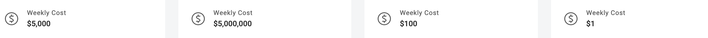

#### Remaining Time

Remaining time should handle situations when we have less than 1 week left or if time is already passed:

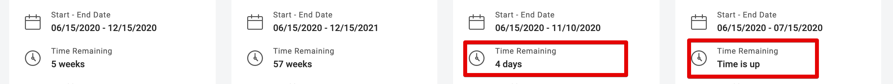

#### Rating

Star rating should handle edge cases like: full rating, zero rating and also ratings which have decimal points like `3.38`. Each of the teams demonstrate some of these cases:

- http://localhost:3000/taas/myteams/1

  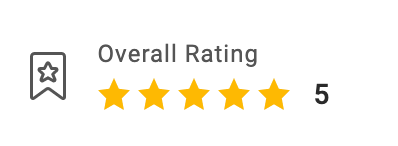

- http://localhost:3000/taas/myteams/3

  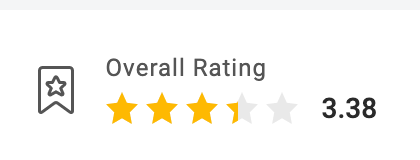

- http://localhost:3000/taas/myteams/4

  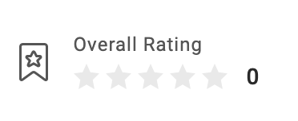

#### No members or positions

UI should handle gracefully, the situation when team doesn't have any members or positions. This is demonstrated by the 4th team http://localhost:3000/taas/myteams/4:

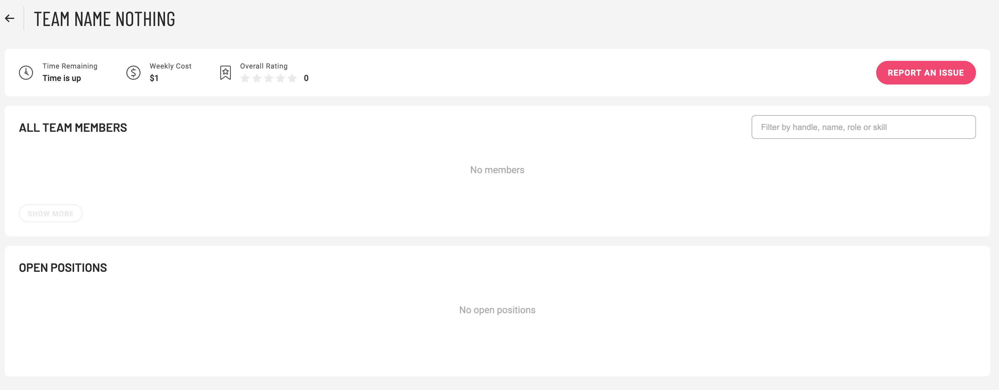

### Dropdown/Tooltips and browser boundaries

All the dropdowns and tooltips should respect browser boundaries and adjust their position when there is not enough space.

Team menu should slightly move when we open it on the last team near the browser scrollbar:

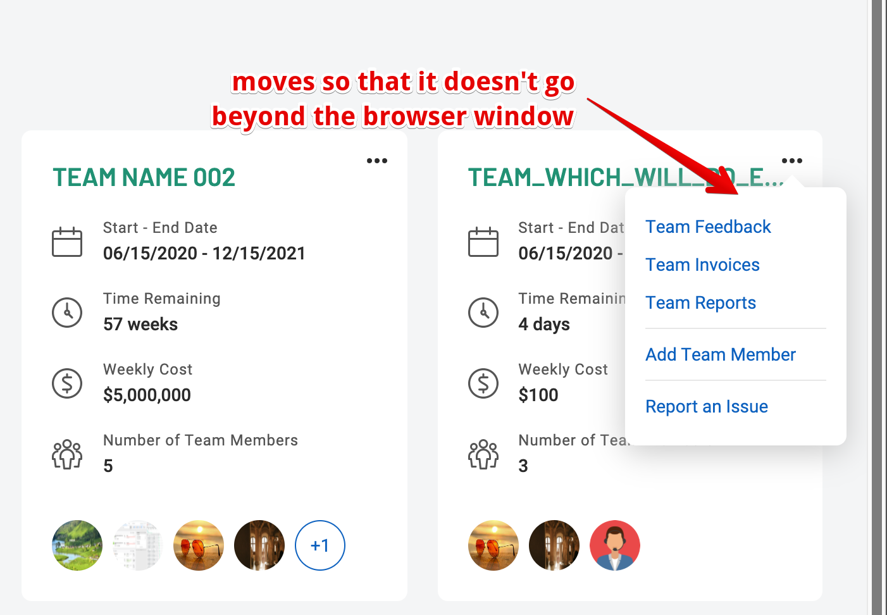

Skills tooltip should open to the top, when we hover "more" link near the bottom edge of the browser, because there is not enough space below.

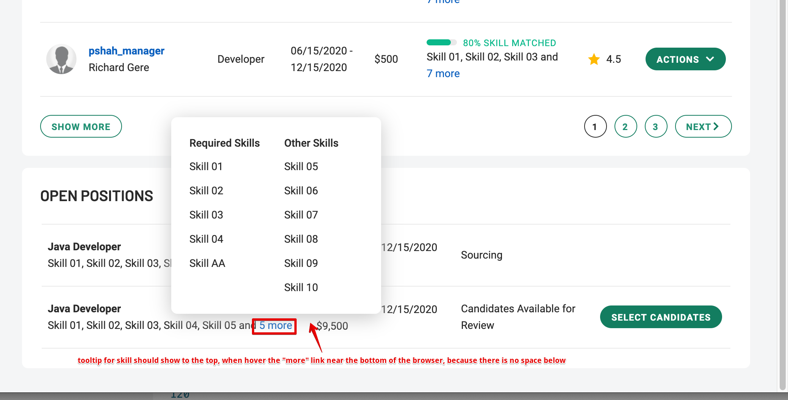

### Text Overflow

As UI outputs user generated data sometimes it may have unexpectedly long texts. We have to make sure, that UI is not getting broken and handles such cases nicely. For this purpose I've created 3rd team with very long texts.
Open http://localhost:3000/taas/myteams/3 for verification.

- Resize browser to check that it's not broken on any resolution.
- Note, that I've tried long texts **without spaces** and **with spaces**.

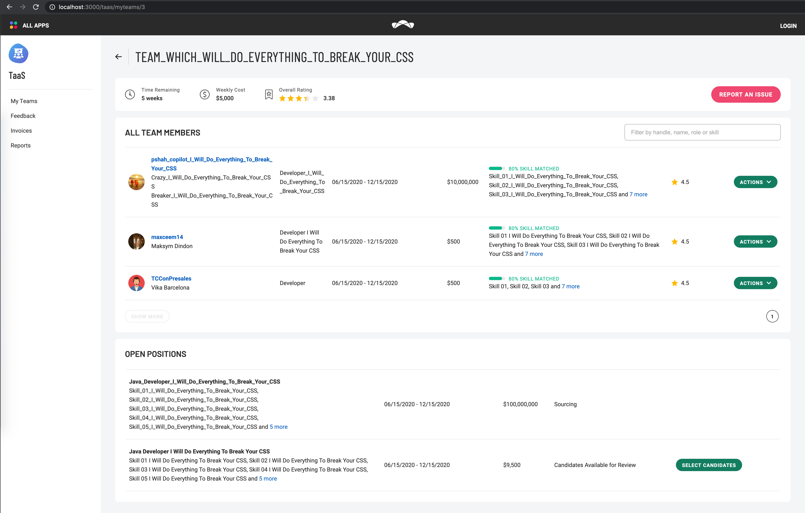

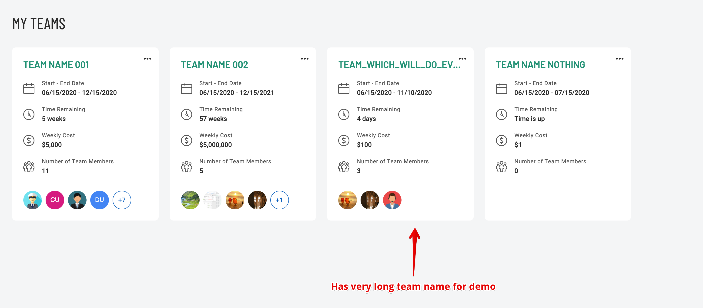

### Members list filtering

Open page with the first team http://localhost:3000/taas/myteams/1.

Let's check filter by each of the supported fields:

- **handle** Enter `con`:

  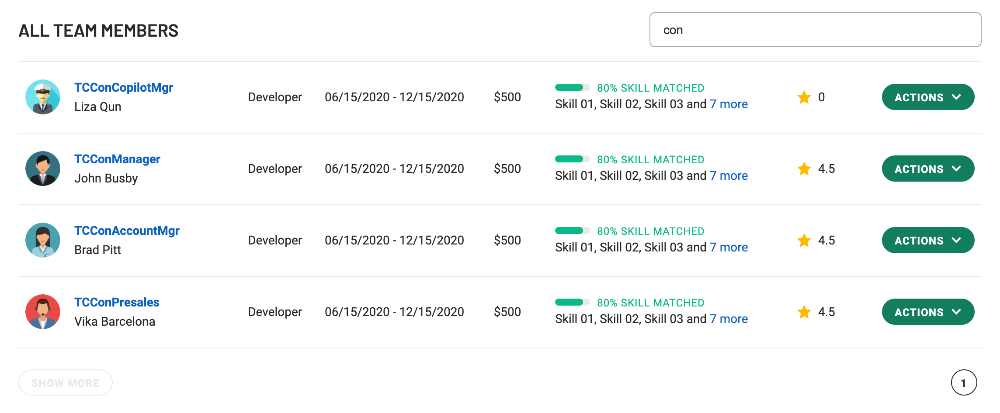

- **firstName** Enter `liza`:

  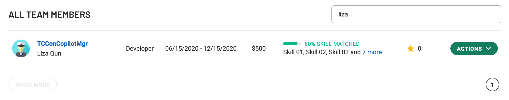

- **lastName** Enter `Unknown`:

  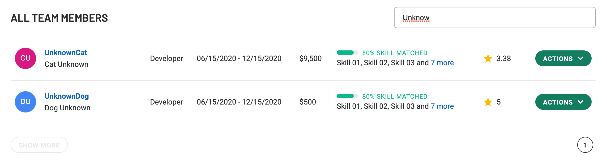

- **role** Enter `des`:

  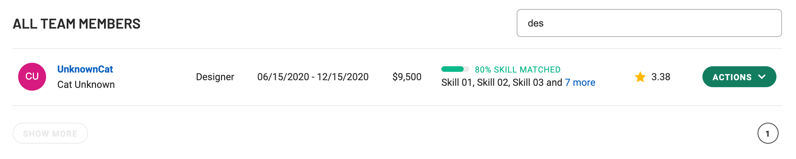

- **skill** Enter `react`:

  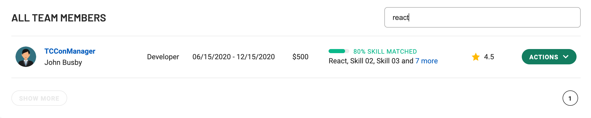

- **combination of fields** Enter `re`:

  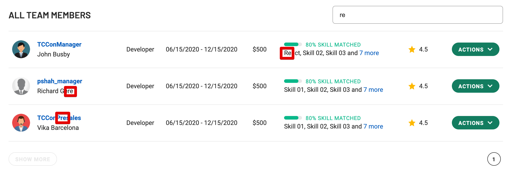

### Job detail

For verification, please use **Team Name 001** http://local.topcoder-dev.com:3000/taas/myteams/1 which has good positions demo data.

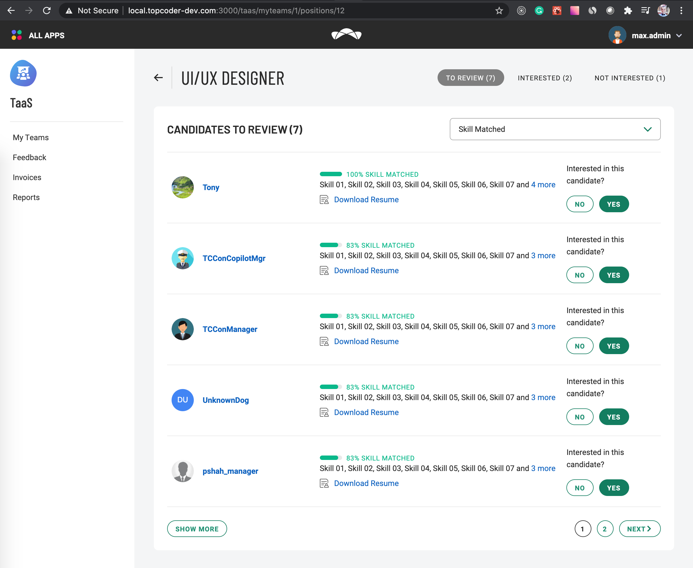

For example of no candidates use **TEAM_WHICH_WILL_DO_EVERYTHING_TO_BREAK_YOUR_CSS** http://local.topcoder-dev.com:3000/taas/myteams/3/positions/32

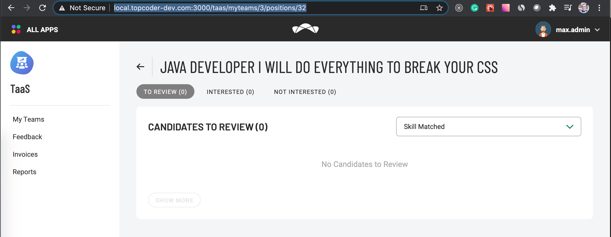

## Notes

1. Rate in positions: `hourly`, `daily`, `weekly` and `monthly`. As UI doesn't mention units, for consistency I convert all the rates to `weekly` rate and show it everywhere for consistency.

   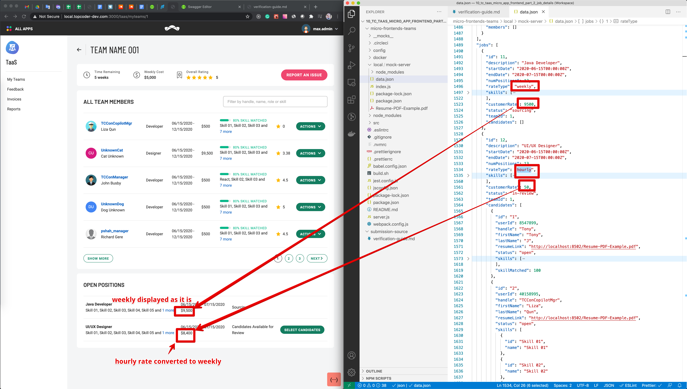

2. In the Swagger file users have a field `photo_url` with avatar photo. Though previously we implemented a method to get user avatar by `userId`, so I'm keeping using that method of getting avatar by `userId`. As a result:

   - I didn't add `photo_url` to mock API
   - I've added `userId` to mock API so I can use real Topcoder API to get user photo

3. Where is not end date, we have to show `TBD` in the `Start - End Date` field. Additionally, I show `N/A` in the **Time Remaining** if there is no `endDate`:

   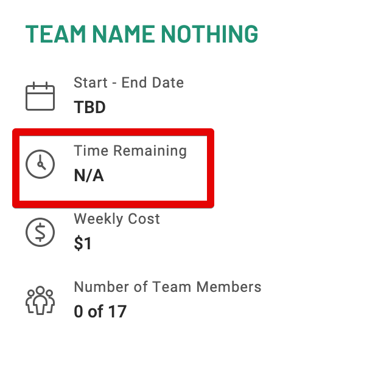

4. When all the candidates can be shown on one page I still showing disabled `Show more` and page `1` so when we change filters there is less jumping for UI consistency:

   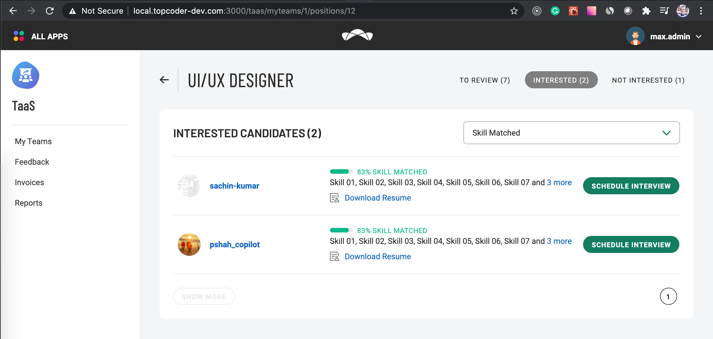
